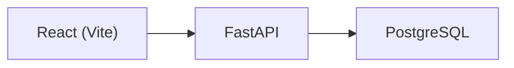

# Safety Incident Reporter - Sinton Mill Edition

Safety Incident Reporter is a focused internal tool for mill operations teams to capture safety hazards and near-miss incidents quickly, track their status through resolution, and maintain a clean operational record. It reduces the friction of paper logs by providing a structured workflow that highlights risk areas and keeps accountability visible across shifts.

## Features

- Full CRUD for incidents (create, view, update, archive)
- Fast filtering by location, category, severity, and status
- Lifecycle tracking with Open -> Investigating -> Resolved states
- Health check endpoint for operational monitoring

## Architecture



## Tech Stack

- **Frontend:** React (Vite)
- **Backend:** FastAPI, SQLModel
- **Database:** PostgreSQL
- **Infra:** Docker Compose
- **Language:** Python 3.13

## Setup

### Local via Docker Compose (recommended)

```bash
docker compose up --build
```

App URLs:

- Frontend: http://localhost:5173
- Backend: http://localhost:8000

Seed demo data (optional):

```bash
docker compose exec backend python scripts/seed.py
```

Stop containers:

```bash
docker compose down
```

### Optional local dev mode (no Docker)

Start the database:

```bash
docker compose up -d db
```

Start the backend:

```bash
cd backend
uv sync
uv run uvicorn app.main:app --reload --port 8000
```

Start the frontend:

```bash
cd frontend
npm install
npm run dev
```

Seed demo data (optional):

```bash
cd backend
uv run python scripts/seed.py
```

## API Reference

Base URL: `http://localhost:8000`

| Method | Endpoint          | Description            |
| ------ | ----------------- | ---------------------- |
| GET    | `/health`         | Health check           |
| POST   | `/incidents`      | Create incident        |
| GET    | `/incidents`      | List incidents         |
| PATCH  | `/incidents/{id}` | Update incident fields |
| DELETE | `/incidents/{id}` | Archive incident       |

### Example payloads

Create incident:

```json
{
  "location": "Rolling Mill",
  "category": "Mechanical",
  "severity": "High",
  "description": "Conveyor motor overheating",
  "reported_by": "Operator A",
  "photo_url": "https://example.com/photo.jpg"
}
```

List incidents (include archived):

```bash
curl "http://localhost:8000/incidents?include_archived=true"
```

Update status:

```json
{
  "status": "Resolved"
}
```

Archive incident:

```bash
curl -X DELETE http://localhost:8000/incidents/1
```

## Schema Summary

Table: `incidents`

| Field         | Type      | Notes                                            |
| ------------- | --------- | ------------------------------------------------ |
| `id`          | int       | Primary key                                      |
| `location`    | text      | Mill area                                        |
| `category`    | text      | Mechanical, Electrical, Chemical, Slip/Trip/Fall |
| `severity`    | text      | Low, Medium, High                                |
| `description` | text      | Required                                         |
| `status`      | text      | Open, Investigating, Resolved                    |
| `reported_by` | text      | Optional                                         |
| `photo_url`   | text      | Optional                                         |
| `is_archived` | bool      | Soft delete flag                                 |
| `created_at`  | timestamp | Server default                                   |
| `updated_at`  | timestamp | Auto-updated                                     |
| `resolved_at` | timestamp | Set when resolved                                |

## Future Improvements

- Authentication and session management
- Role-based access control (RBAC)
- Photo upload and storage integration
- Audit logging for status changes
