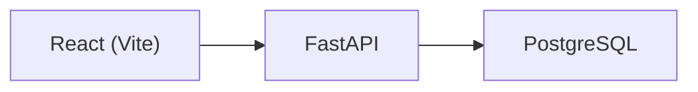

# Safety Incident Reporter - Sinton Mill Edition

Safety Incident Reporter is a focused internal tool for mill operations teams to capture safety hazards and near-miss incidents quickly, track their status through resolution, and maintain a clean operational record. It reduces the friction of paper logs by providing a structured workflow that highlights risk areas and keeps accountability visible across shifts.

## Features

- Incident intake form with required-field validation and optional reporter/photo fields
- Two-column responsive layout for form inputs with clear section cards
- Fast filtering by location, category, severity, and status
- Sorting by created time, severity, status, or location
- Status + severity badges with high-contrast styling for quick scanning
- Dashboard summary metrics (Open, Investigating, High Severity)
- Incident table with zebra striping, sticky headers, and scrollable results
- Description truncation with Expand/Collapse for long entries
- Streamlined actions with primary status dropdown and archive confirmation
- Success/error toast notifications for key actions
- Backend health status display plus `/health` API endpoint

## Architecture



## Tech Stack

- **Frontend:** React (Vite)
- **Backend:** FastAPI, SQLModel
- **Database:** PostgreSQL
- **Infra:** Docker Compose
- **Language:** Python 3.13

## Setup

### Docker Compose (recommended)

Start everything:

```bash
docker compose up --build
```

App URLs:

- Frontend: http://localhost:5173
- Backend: http://localhost:8000

Seed demo data (optional):

```bash
docker compose exec backend python scripts/seed.py
```

Stop containers:

```bash
docker compose down
```

#### Docker: LAN / mobile access

The frontend automatically calls the backend using the current hostname and the
configured API port, so any device on the same Wi-Fi works.

1. Ensure containers are running:
   - `docker compose up -d --build`
2. Find your laptop LAN IP (e.g. `192.168.1.23`).
3. On your phone, open:
   - Frontend: `http://<your-lan-ip>:5173`
   - Backend health check: `http://<your-lan-ip>:8000/health`

Notes:

- Compose already exposes `0.0.0.0:8000` for the backend and `0.0.0.0:5173` for the frontend.
- If access fails, check firewall prompts for Docker.

### Local development (no Docker)

This mode runs the backend + frontend directly on your machine.

#### Requirements

- Python 3.13
- Node.js 20+
- `uv` (for Python deps)

#### Start the database (Postgres via Docker)

```bash
docker compose up -d db
```

#### Start the backend

```bash
cd backend
uv sync
uv run uvicorn app.main:app --reload --host 0.0.0.0 --port 8000
```

#### Start the frontend

```bash
cd frontend
npm install
npm run dev -- --host 0.0.0.0
```

App URLs:

- Frontend: http://localhost:5173
- Backend: http://localhost:8000

Seed demo data (optional):

```bash
cd backend
uv run python scripts/seed.py
```

#### Local dev: LAN / mobile access

- Desktop: http://localhost:5173 → backend http://localhost:8000
- Phone on the same Wi-Fi: http://<your-lan-ip>:5173 → backend http://<your-lan-ip>:8000

Make sure:

- Backend runs on `0.0.0.0:8000`
- Frontend runs with `npm run dev -- --host 0.0.0.0`
- `frontend/.env.local` includes `VITE_API_PORT=8000`

## API Reference

Base URL: `http://localhost:8000`

| Method | Endpoint          | Description            |
| ------ | ----------------- | ---------------------- |
| GET    | `/health`         | Health check           |
| POST   | `/incidents`      | Create incident        |
| GET    | `/incidents`      | List incidents         |
| PATCH  | `/incidents/{id}` | Update incident fields |
| DELETE | `/incidents/{id}` | Archive incident       |

### Example payloads

Create incident:

```json
{
  "location": "Rolling Mill",
  "category": "Mechanical",
  "severity": "High",
  "description": "Conveyor motor overheating",
  "reported_by": "Operator A",
  "photo_url": "https://example.com/photo.jpg"
}
```

List incidents (include archived):

```bash
curl "http://localhost:8000/incidents?include_archived=true"
```

Update status:

```json
{
  "status": "Resolved"
}
```

Archive incident:

```bash
curl -X DELETE http://localhost:8000/incidents/1
```

## Schema Summary

Table: `incidents`

| Field         | Type      | Notes                                            |
| ------------- | --------- | ------------------------------------------------ |
| `id`          | int       | Primary key                                      |
| `location`    | text      | Mill area                                        |
| `category`    | text      | Mechanical, Electrical, Chemical, Slip/Trip/Fall |
| `severity`    | text      | Low, Medium, High                                |
| `description` | text      | Required                                         |
| `status`      | text      | Open, Investigating, Resolved                    |
| `reported_by` | text      | Optional                                         |
| `photo_url`   | text      | Optional                                         |
| `is_archived` | bool      | Soft delete flag                                 |
| `created_at`  | timestamp | Server default                                   |
| `updated_at`  | timestamp | Auto-updated                                     |
| `resolved_at` | timestamp | Set when resolved                                |

## Future Improvements

- Authentication and session management
- Role-based access control (RBAC)
- Photo upload and storage integration
- Audit logging for status changes
